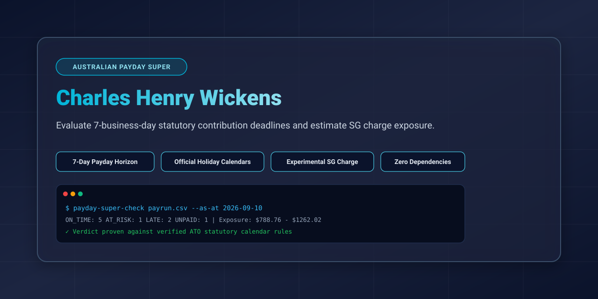
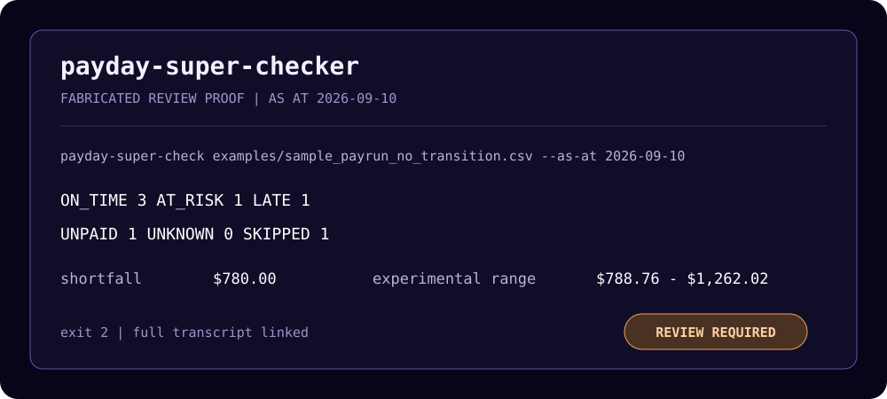

# payday-super-checker

```
+----------------------------------------------------------------------+
|                         payday-super-checker                         |
+----------------------------------------------------------------------+
|              SG charge and due dates since 1 July 2026               |
+----------------------------------+-----------------------------------+
| DR  what it gives you            | CR  what it needs                 |
+----------------------------------+-----------------------------------+
| due date per payday event        | payroll export CSV                |
| notional earnings and uplift     | fund receipt dates                |
| audit trail per employee         | national holiday calendar         |
+----------------------------------+-----------------------------------+
```



[](https://github.com/ryanduguid/payday-super-checker/actions/workflows/ci.yml) [](https://pypi.org/project/payday-super-checker/) [](LICENSE) [](https://www.python.org/downloads/)

**Experimental review aid. Not a compliance determination.** Check Australian
super contributions against the payday-super deadlines and produce an
experimental SG-charge estimate for lines that the supplied facts establish as
late.

Since 1 July 2026, super is generally due within 7 business days of each payday
instead of quarterly. A missed deadline can create an SG shortfall, notional
earnings and administrative uplift; the ATO makes the assessment. This tool
reviews a CSV from payroll, clearing-house and fund records. It refuses or marks
`UNKNOWN` where those records do not establish the statutory facts.

The repository name is the public project identity; the `payday-super-checker` distribution, `payday-super-check` command and `paydaysuper` import package remain compatibility identifiers.

Built by Ryan Duguid, a provisional member of Chartered Accountants ANZ. Written independently, in his own time and on his own equipment.

No-install explainer: [When is payday super actually due](https://duguid.com.au/tools/payday-super/). From an AI coding agent, run the same engine through [aus-accounting-mcp](https://duguid.com.au/tools/australian-tax-ai-agents/).

Citation: [`CITATION.cff`](CITATION.cff); release: [`v0.1.2`](https://github.com/ryanduguid/payday-super-checker/releases/tag/v0.1.2).

## Quick proof

[](assets/quick-proof.md)

The card comes from the fabricated sample and links to the complete console transcript. Re-run the sample and confirm that both committed proof files are current:

```bash
python tools/render_quick_proof.py --check
```

## Install

Python 3.10 or later. No runtime dependencies.

```bash
git clone https://github.com/ryanduguid/payday-super-checker.git
```

```bash
cd payday-super-checker && pip install .
```

Cloning first means you have the sample file the next command uses. To skip
the clone, `pip install payday-super-checker` installs the tool alone from
PyPI; point it at your own CSV.

## Before you run

Gather these facts first. The checker refuses or marks `UNKNOWN` where the
records do not establish them.

| Fact | Where it comes from | Why |
| --- | --- | --- |
| Payroll export | Your payroll system | The payday (the day you actually paid the wages) and the operator-determined SG amount per employee. Apply regulations 11 and 12 and filter out salary sacrifice before supplying the amount |
| Super payment export | Your payroll or clearing-house portal | The day you sent the money. This is the `remitted` date; on its own it can only give `AT_RISK` |
| Fund receipt dates | Your clearing house's per-contribution settlement or status report, or the fund's own contribution history | The law tests receipt by the fund. No payroll system or clearing house exports this date, so fill it in before treating any verdict as final |
| Holidays coverage | The bundled calendar, complete through 31 August 2027 | Deadlines past that horizon fail closed until you supply later official dates in a reviewed `--holidays-override` file with `verified_until` |

## Use

Review the remittance-versus-fund-receipt boundary with the
[fabricated Payday Super evidence evaluation](evaluation/payday_super_evidence/README.md).

Start with the sample that has no transition-period contributions. This
command runs to a verdict with no confirmation flags:

```bash
payday-super-check examples/sample_payrun_no_transition.csv --as-at 2026-09-10
```

```
payday-super-checker: 7 contribution lines, as at 2026-09-10

  ON_TIME: 3  AT_RISK: 1  LATE: 1  UNPAID: 1  UNKNOWN: 0  SKIPPED: 1

Lines with exposure (experimental estimates, largest first):
  row 5  QE day 2026-08-06  due 2026-08-17  UNPAID, 24 days late to as-at date (nothing applied to this payday)
      shortfall $780.00  notional earnings $5.88  experimental SG charge estimate $785.88 - $1257.41
  row 3  QE day 2026-08-06  due 2026-08-17  LATE, 17 days late to fund receipt
      super $540.00 (received, so the shortfall is nil)  notional earnings $2.88  experimental SG charge estimate $2.88 - $4.61

  Total across 2 line(s): shortfall $780.00, notional earnings $8.76,
  experimental estimated SG charge $788.76 - $1262.02.
```

The second sample, `examples/sample_payrun.csv`, contains contributions from
the 1 to 28 July 2026 transition period, and running it the same way stops
before writing a verdict:

```bash
payday-super-check examples/sample_payrun.csv --as-at 2026-08-10
```

That stop is the tool working as designed. LCR 2026/1 applies 1-28 July 2026
contributions first to any employee shortfall for the quarter ended 30 June
2026, and this file cannot calculate those old-regime balances. The tool asks
for `--confirm-transition-allocation`. Do not copy that flag mechanically:
use it only after you have reconciled every affected employee. The
confirmation is recorded in the report.

```bash
payday-super-check examples/sample_payrun.csv --as-at 2026-08-10 --confirm-transition-allocation
```

```
payday-super-checker: 10 contribution lines, as at 2026-08-10

  ON_TIME: 5  AT_RISK: 1  LATE: 2  UNPAID: 1  UNKNOWN: 0  SKIPPED: 1

Lines with exposure (experimental estimates, largest first):
  row 5  QE day 2026-07-09  due 2026-07-20  UNPAID, 21 days late to as-at date (nothing applied to this payday)
      shortfall $780.00  notional earnings $5.15  experimental SG charge estimate $785.15 - $1256.24
      note: the deadline passed on 2026-07-20 and no remittance or fund-receipt date is recorded...
  row 3  QE day 2026-07-09  due 2026-07-20  LATE, 15 days late to fund receipt
      super $540.00 (received, so the shortfall is nil)  notional earnings $2.54  experimental SG charge estimate $2.54 - $4.07

  Total across 3 line(s): shortfall $780.00, notional earnings $8.07,
  experimental estimated SG charge $788.07 - $1260.92.
```

Both output blocks above are abridged: the real runs list every exposed line and then a page
of assumptions. The console deliberately identifies an exposed record by its input row
rather than its employee identifier, so redirected output does not place payroll
identifiers in process logs. Use that row number to find the full record in
`report.csv`.

Full detail goes to `report.csv`: due date, which deadline rule applied, days late, the final shortfall after any offset, notional earnings, best and worst case uplift, and every warning that applies to that line.

### The remittance-versus-fund-receipt boundary

`examples/sample_remittance_only.csv` isolates the one fact no payroll system
or clearing house exports. Every line in it was remitted on or before its own
deadline, and every `fund_received_date` is blank, which is exactly the shape
a vendor import gives you. Nothing in the file is late, and nothing in it can
be proved on time:

```bash
payday-super-check examples/sample_remittance_only.csv --as-at 2026-09-10
```

```
payday-super-checker: 4 contribution lines, as at 2026-09-10

  ON_TIME: 0  AT_RISK: 4  LATE: 0  UNPAID: 0  UNKNOWN: 0  SKIPPED: 0

This file cannot produce ON_TIME: no in-scope positive row has a fund-receipt date on or before the as-at date. Fill fund_received_date from the clearing house or fund, then rerun. To accept remittance-only AT_RISK results after that gap is understood, pass --confirm-remittance-only. No payroll payment, lodgment or accounting decision is made by this tool.

4 line(s) remitted by the deadline but with no fund-receipt date. The statutory timing test turns on receipt by the fund, not the day you paid, and clearing-house transit time is the employer's risk.
```

That run exits 2. There is no exposure in the file and no deadline the
calendar could not decide, so the missing receipt date is the only thing
holding the run above zero. Confirming that you accept a remittance-only
review exits 0 and leaves every verdict where it was:

```bash
payday-super-check examples/sample_remittance_only.csv --as-at 2026-09-10 --confirm-remittance-only
```

```
payday-super-checker: 4 contribution lines, as at 2026-09-10

  ON_TIME: 0  AT_RISK: 4  LATE: 0  UNPAID: 0  UNKNOWN: 0  SKIPPED: 0

Operator confirmed remittance-only review: no in-scope positive row has a fund-receipt date on or before the as-at date, so this file cannot produce ON_TIME. The confirmation is recorded; fill fund_received_date from the clearing house or fund before treating a verdict as final.

4 line(s) remitted by the deadline but with no fund-receipt date. The statutory timing test turns on receipt by the fund, not the day you paid, and clearing-house transit time is the employer's risk.
```

Both blocks are abridged in the same way as the two above: the real runs also
print the assumptions page. The flag records that you understand the gap. It
does not turn `AT_RISK` into `ON_TIME`, because paying on time is not the
statutory test. Fill `fund_received_date` from your clearing house or fund and
rerun before treating any verdict here as final.

### Build a practitioner review pack

Turn the completed checker report into a deterministic Markdown index and
sign-off checklist:

```bash
payday-super-check review-pack report.csv -o practitioner-review.md
```

**The report argument must be a bare `.csv` filename in the current directory.**
Unlike every other path this tool accepts, `review-pack` refuses a directory
part: `sub/report.csv`, `./report.csv` and an absolute path are all rejected
with exit code 1. `cd` to the directory holding the report, or copy it beside
you, and pass the filename alone. The `-o` output path is unrestricted.

The pack binds itself to the exact report bytes with SHA-256, recounts every
verdict, reconciles the displayed experimental range and puts each non-`ON_TIME`
row into a human review queue. It refers to the source CSV's `row` value rather
than copying employee identifiers into Markdown. Keep the source report beside
the pack in the same access-controlled workpaper location: the CSV remains the
row-level evidence.

The consumer fails closed unless the report has the exact current 18-column
contract, valid displayed arithmetic and one final full-width `NOTE` row. Exit
code 2 means the pack contains at least one non-`ON_TIME` row; exit code 1 means
the source or output was invalid. A pack with no exception indicators still
requires practitioner sign-off. The command does not advise, correct, pay,
lodge, disclose or turn the checker output into a compliance determination.

Verdicts are `ON_TIME`, `AT_RISK` (remitted in time but no fund receipt recorded), `LATE`, `UNPAID` (a supported deadline has passed and a full eligible fund receipt is not established, including where there is no receipt or only a partial receipt), `UNKNOWN` (the verdict is not available) and `SKIPPED` (defined-benefit interests). `LATE` and `UNPAID` both carry experimental exposure figures.

Some `UNKNOWN` rows are quiet because there is nothing to assess yet: a
supported deadline has not passed, the row carries no SG amount, or a stale
pre-payment is recorded before a supported deadline. Other `UNKNOWN` rows need
attention and drive exit code 2. This happens when a deadline extends past the
holiday table's complete horizon, including an unfunded row whose deadline may
not have passed, or when an earlier positive row could trigger item 4 but does
not evidence an eligible contribution that was received, legally allocated to
that earlier QE day and on time. These rows get their own console block and the
CSV records conservative outer outcomes in `unassessable_between`, such as
`LATE or ON_TIME`, `LATE or UNPAID`, `UNPAID or NOT_YET_DUE`, or `LATE or
AT_RISK`. A caveat may name an intermediate outcome where more than two remain
possible. Read that column when parsing the file: `UNKNOWN` alone also covers
nil rows with nothing at risk.

To get a real verdict, enter the missing holidays in a `--holidays-override` file and add `"verified_until": "YYYY-MM-DD"` naming the last date you entered them for. The holidays alone are not enough, and that is deliberate: a file holding one 2029 holiday is not a file that has 2029 covered, and treating it as one would silence the warning across every gap it left. Only you know how far you went.

```json
{
  "verified_until": "2029-12-31",
  "add": [
    {"date": "2029-03-30", "name": "Good Friday", "jurisdictions": ["ALL"]},
    {"date": "2029-04-02", "name": "Easter Monday", "jurisdictions": ["ALL"]}
  ],
  "remove": []
}
```

A date on or before a deadline that runs past the calendar's coverage still gets a verdict. A missing holiday can only push the real deadline later, so paying early is provably on time whatever the calendar is missing.

The exit code is 0 when nothing is exposed, nothing is left undecided, and the file can produce an ON_TIME result (or you passed `--confirm-remittance-only` after accepting that it cannot). It is 2 when any of those is untrue, and 1 on a data or file error, so you can run it from a scheduled job. A file where no in-scope positive row carries a `fund_received_date` on or before the as-at date is undecided in that sense: vendor imports never write that column, so the advertised two-command path is remittance-only `AT_RISK` until you fill the dates. A receipt dated after `--as-at` counts as absent here, because the run discards it as future and says so in that row's own caveat. Argparse also uses 2 for a bad command line, so a wrapper should check stderr before raising an alarm.

### Options

| Option | What it does |
| --- | --- |
| `-o, --output` | Where to write the report CSV (default `report.csv`) |
| `--as-at DATE` | Measures notional earnings on still-unpaid contributions to this date (default: today, read from the host clock and named in a printed notice). Pass it explicitly in scheduled or CI runs: the host clock's calendar day can differ from the Australian date near midnight, and a verdict can turn on that day |
| `--assessment-date DATE` | The day the ATO assessed the charge for these paydays. Only eligible contributions received before it can reduce the final shortfall; a part receipt may not clear it. Omit if no assessment has issued |
| `--map FIELD=COLUMN` | Point one field at your column name; repeatable |
| `--mapping-file FILE` | Same thing as JSON, see `examples/mapping.example.json` |
| `--holidays-override FILE` | Add or remove public holidays from the bundled calendar; its optional `verified_until` declares how far you have entered them |
| `--confirm-transition-allocation` | Confirm you reconciled LCR 2026/1 for every contribution dated no later than 28 July 2026: pre-1 July amounts are unused excess and 1 to 28 July amounts remain after any June-quarter employee shortfall |
| `--confirm-remittance-only` | Confirm you accept a remittance-only review because no in-scope positive row has a fund-receipt date on or before the as-at date. Without this flag that file exits 2: it cannot produce ON_TIME |

### Input columns

Required: `employee_id`, `payment_date`, `sg_amount`. Everything else is optional but sharpens the answer.

| Field | Column in the sample | Meaning |
| --- | --- | --- |
| `employee_id` | `employee_id` | Anything that identifies the employee consistently |
| `qe_day` | `payment_date` | The day you actually paid the wages, not the period end or payslip date |
| `sg_amount` | `sg_amount` | Super guarantee for that payment |
| `remitted` | `remitted_date` | Day you sent the money |
| `remitted_amount` | `remitted_amount` | Amount covered by `remitted_date`. Blank on a dated legacy row means the whole `sg_amount`; a value requires `remitted_date` and cannot exceed `sg_amount`. This records operational remittance only. It does not reduce a statutory shortfall without an eligible fund receipt |
| `matched_amount` | `matched_amount` | Total vendor contribution amount associated with this payday, capped at `sg_amount`. The importer writes an explicit amount even when the vendor supplied no payment date: zero for no match, the partial amount for a short match, and the liability for a full or over match. It is not proof of remittance or fund receipt. When you later add `fund_received_date`, it caps the amount that date can evidence. If it is below `sg_amount` and `remitted_date` is present, `remitted_amount` is required. Blank retains the legacy whole-liability meaning |
| `received` | `fund_received_date` | Day the fund received the eligible contribution associated with this QE day. Receipt is necessary for an on-time result; the row association also asserts the contribution was allocable and applied to this QE day under the statutory ordering. Receipt credit is capped first by `matched_amount`, then by `remitted_amount` for older ten-column partial files; a legacy row with neither amount means the whole `sg_amount` |
| `first_to_fund` | `first_contribution_to_fund` | Yes for the first contribution to that fund (new starter, or a fund switch) |
| `out_of_cycle` | `out_of_cycle` | Yes only for an allowance, bonus, commission, loading, payment in advance or back payment made outside an established payment timing, pattern or schedule, where the statutory next-standard-payment conditions are met |
| `next_standard_qe_day` | `next_standard_payday` | The next schedule-consistent day on which the employer actually made a subsequent non-out-of-cycle QE payment. A planned payday or a date after employment ended is not enough |
| `db_interest` | `defined_benefit` | Yes for defined-benefit interests, which are skipped |

Dates read as `YYYY-MM-DD`, day-first `DD/MM/YYYY`, or `9 Jul 2026`, and a zone-less time component is ignored. A date-time carrying a `Z` or UTC-offset marker is refused: its as-written day belongs to that zone, and a UTC evening stamp is already the next day in Australia, so keeping the written day could pass a receipt that was actually a day later. Convert it to the Australian local calendar date first. Amounts accept `$` and thousands separators, and are read to the cent (ROUND_HALF_UP) at both the import and check boundaries, so the same figure means the same number whichever door it comes through; a non-zero value under half a cent is refused rather than rounded to nothing. Anything unreadable stops the run and names up to twenty bad cells at once, and so does a truncated row, a duplicated column heading, or a mapping that points at a column your file does not have. This experimental review tool refuses facts it cannot safely infer.

**The amount column must hold the operator-determined SG amount only.** Apply
the employee and payment boundaries in regulations 11 and 12, the
qualifying-earnings rules, the maximum contribution base and any other relevant
facts before supplying it. Salary sacrifice and additional contributions have a
different base and deadline, so filter them out. The tool does not classify raw
pay, apply regulations 11 or 12, or decide whether a termination payment is
qualifying earnings. LCR 2026/D1 remains draft, so those decisions stay human.

**Where the fund receipt date comes from.** Payroll exports (Xero, MYOB, KeyPay, Employment Hero) give you the payday and the batch remittance date, which is what `remitted` is for and why those lines come back `AT_RISK`. A fund receipt date lives somewhere else: your clearing house's per-contribution settlement or status report, or the fund's own contribution history. Without it the tool tells you what you sent and when, not what the law tests.

## Import from your payroll system

Two commands turn a payroll export and a super payments export into a checked report, with no column mapping to write by hand:

```bash
payday-super-check import --payroll "Payroll Activity Details.csv" --super "Superannuation Payments.csv" -o contributions.csv --confirm-statutory-allocation
payday-super-check contributions.csv --confirm-transition-allocation
```

The second command exits 2 until `fund_received_date` is filled in, or until
you pass `--confirm-remittance-only` after accepting remittance-only `AT_RISK`
results. Do not copy that flag mechanically either.

The first command reads both exports and writes the canonical CSV the second
command checks. Where an employee has more than one in-scope positive payday,
it stops without output unless you pass `--confirm-statutory-allocation`. Do not
copy that flag mechanically. LCR 2026/2 paragraphs 31 to 33 apply contributions in
fund-receipt order to the earliest QE day with a base or final shortfall. Vendor
exports provide employer payment dates and pay-period labels, not that receipt
order or the assessment facts that can change it. Use the flag only after you
have reconciled every relevant payday, contribution receipt and assessment and
confirmed that the export's periods plus payment-date/row order reproduce the
statutory allocation. The importer allocates a short shared payment to the
earliest covered shortfall; it no longer treats the vendor period end as an
instruction to pay a later QE day first. The confirmation is printed in the
import record.

Profiles ship for Xero Payroll, MYOB AccountRight, MYOB Business and Employment Hero / KeyPay, one profile each for the payroll-activity report and the super-payments report. The importer picks a profile per file by scoring column headings against what it knows. Force one with `--vendor xero`, `--vendor myob-ar`, `--vendor myob-business` or `--vendor employment-hero` when detection cannot pick, or to skip detection outright.

**Every shipped profile is unverified against a real export.** Each one's column names come from vendor help documentation, and Xero, MYOB and Employment Hero do not publish an actual column list for these reports, so the first real export you try may match no profile at all. When that happens the importer prints the column headings it found in your file next to the headings each candidate profile wanted. Send both lists back and fixing the profile is a one-line edit to its JSON file, not a rewrite.

**No payroll system or clearing house exports a fund receipt date.** Xero's report gives the date a payment was sent to the fund. MYOB gives a Paid Date. Employment Hero gives a Beam status (Sent to fund, Reconciled, and so on). None of these is the date the fund received the money. The legal deadline tests receipt by the fund, and time in transit through a clearing house is the employer's risk, not the fund's, so a vendor date is a remittance date and `fund_received_date` is left blank on every row. Fill that column in from your fund or clearing house before treating any verdict from the checker as final. `remitted_date` is the latest known vendor date for the dated subtotal; an entirely undated match leaves it blank. The Beam status also decides whether the date counts at all: a batch still at Created, Submission accepted or Awaiting payment is money that never left the employer, so its Payment Date is not written as a remittance date and the payday reads as unfunded, with a warning naming the status. A status outside the Beam ladder stops the import rather than being guessed either way.

**A mixed dated/undated match uses the latest known date conservatively.** If 600.00 of a 1000.00 match has a vendor date and 400.00 does not, `remitted_date` is the latest known date for the dated subtotal, `remitted_amount` is 600.00 and `matched_amount` is 1000.00. An as-at report shows none of the dated subtotal as remitted before the date and only 600.00 on or after it; the undated 400.00 stays operationally unremitted. A dated 999.99 part payment writes 999.99 in both amount fields, leaving 0.01 operationally unremitted. That vendor evidence does **not** reduce the statutory base or final shortfall by itself: without `fund_received_date`, the SGC estimate continues to treat the full 1000.00 as unreceived. If an eligible fund receipt is supplied on the row, it can credit at most `matched_amount`; an on-time partial receipt reduces the base shortfall, while a late partial receipt can reduce only the final shortfall and not the base used for notional earnings. An entirely undated match leaves both remittance fields blank but still writes its total to `matched_amount`, so adding a later receipt date cannot turn a known partial match into full credit. `sg_amount` is always the amount owed.

The importer still prints `row N: partial: 999.99 of 1000.00 matched` and `row N: 400.00 of 1000.00 matched has no payment date on record; latest known payment date 2026-07-15`. Neither line is ever truncated by the warning cap.

**A full financial-year export needs trimming first.** The check refuses any file holding a payday before 1 July 2026, because the old quarterly law governs those and this tool does not model it. An export that starts at 1 July 2025 therefore imports fine and then fails the check outright. The import names those rows in a warning and writes them anyway; delete them from the canonical file, or re-export from 1 July 2026, before running the second command.

**A bare filename of `import` does not work.** `payday-super-check import`, run against a file that is genuinely named `import` with no extension, is read as the import subcommand and fails on the missing `--payroll`/`--super` arguments instead of checking the file. `payday-super-check import.csv` and `payday-super-check ./import` both check the file as expected; only the exact bare string `import` is swallowed.

## Local file boundary

This is a single-user command-line tool. Its positional input, importer input, mapping, calendar override and output arguments designate files the invoking operating-system account has chosen to read or write; they are not a sandbox. The one exception is `review-pack`'s report argument, which must be a bare `.csv` filename in the current directory and is opened there. Do not expose the command as a web endpoint, multi-user service, or automation that accepts path values from a less-trusted caller without adding an appropriate safe-root boundary.

Contribution and report outputs must have an explicit `.csv` filename; the
practitioner pack must have an explicit `.md` filename. They are staged in the
selected output directory and atomically replace the selected output name. This
means an existing output symlink is replaced rather than followed, and a failed
write does not leave a partial output at that name. Each command refuses an
output path that resolves to a file it reads: for the check, the contribution
CSV, a `--mapping-file` and a `--holidays-override`; for the import, both
exports; and for `review-pack`, the report CSV. A suffix rule does not cover
this on its own, because an input is free to carry the same suffix.

## The rules it applies

The enacted framework is the Treasury Laws Amendment (Payday Superannuation) Act 2025 (No. 57 of 2025, assent 6 November 2025), the Superannuation Guarantee Charge Amendment Act 2025 (No. 58 of 2025), and the regulations registered as F2026L00133, which amend the Superannuation Guarantee (Administration) Regulations 2018; the current 1 July 2026 compilation is F2026C00535. It applies to paydays from 1 July 2026. A primary-source implementation review was completed on **15 August 2026**. [The review](docs/primary-source-review-2026-08-15.md) records the exact legislation, final ruling status, holiday authorities, runtime comparison and residual limits. It does not turn this experimental tool into an ATO compliance determination or authorise a release. The 15 August review is the maintained primary-source record.

ATO LCR 2026/1, LCR 2026/2 and LCR 2026/3 were issued on 5 August 2026. LCR 2026/D1 remains draft pending the appeal from *Department of Education v Commissioner of Taxation* [2026] FCA 898. The tool therefore accepts an operator-provided SG amount and does not decide qualifying-earnings or termination classifications.

**The deadline.** A contribution is on time only if the fund *receives* it, with enough information to allocate it, by the end of the seventh business day after the payday (SGAA 1992 s 6(1) "usual period", s 18C(1)(c)). Paying a clearing house by the deadline does not count, and the ATO's small business clearing house closed on 30 June 2026, so transit time is now the employer's risk. That is why a line with a remittance date but no fund receipt date comes back `AT_RISK` rather than `ON_TIME`.

**Business days.** SGAA s 6(1) defines a business day as any day that is not a Saturday, a Sunday, or a public holiday for the whole of any State, the ACT or the NT. One national calendar applies to every employer: WA Day stops the clock for a Sydney employer. Regional and locally substitutable holidays do not. The Brisbane Ekka, WA's default King's Birthday date and Melbourne Cup Day are therefore business days for this definition. The bundled calendar is complete from July 2026 through **31 August 2027**. Business Victoria still lists the exact 2027 grand-final holiday as subject to the AFL schedule, so later deadlines fail closed until that date is officially published or supplied through a reviewed override. Unconfirmed dates do not extend a deadline.

**20 business days instead of 7** for the first contribution to a particular fund, whether that is a new starter or an existing employee switching funds (s 18C(2) item 1). Under item 4, a later QE day's deadline can align to an earlier contribution's later end only if that earlier eligible contribution was made and applied under s 18C(1). The checker applies the extension only where the earlier canonical row evidences an on-time fund receipt and thereby asserts the statutory allocation. A positive amount or remittance alone is not enough. If the missing fact could change the verdict, the later row is attention-driving `UNKNOWN`, not treated as extended. Include each employee's earlier paydays and reconcile their LCR 2026/2 allocation; a single pay run cannot establish the rule.

**Out-of-cycle payments** can ride a subsequent standard QE payment's window rather than their own (SGAA s 18C(2) item 2 and s 18C(3); final determination F2026L00784). The earlier review called this “LI 2026/20”, but that shorthand is not shown on the Federal Register's as-made page; this project uses the controlling registered identifier and text instead. The final determination covers six kinds of qualifying earnings: allowances, bonuses, commissions, loadings, payments in advance and back payments. The employer must have an established timing, pattern or schedule for qualifying-earnings payments, and the payment must fall outside it. It also requires the employer to actually make a subsequent non-out-of-cycle qualifying-earnings payment on the next day consistent with that schedule. A planned next payday, or a termination/final payment with no later payment, does not establish item 2. `out_of_cycle=yes` without the date of that actual subsequent payment is a hard error. Where both this rule and the new-fund rule apply, the later deadline governs.

**When it is late,** notional earnings compound daily at the general interest charge rate on the base shortfall for each late-period day on which the final shortfall remains greater than nil (s 19A), and an administrative uplift of up to 60% applies on top. A full late contribution received before the ATO assesses the charge can clear the final shortfall under s 18D, which is why a fully paid-but-late line shows a small experimental estimate rather than the whole contribution. A part late receipt reduces only the final shortfall: it does not retrospectively reduce the base used for notional earnings, and accrual continues while a remainder exists. Pass `--assessment-date` if an assessment has already issued; a receipt on or after that date does not reduce the final shortfall in this estimate.

The uplift starts at 60% and falls 20 points where the clean-history test is met, and another 40, 35, 30 or 15 points according to voluntary-disclosure timing. For QE days through 30 June 2028, the transitional clean-history lookback begins on 1 July 2026 rather than reaching back a full 24 months. The report shows both ends of the range because the ATO, not this tool, decides which reductions apply. Read the low figure carefully: it assumes both a clean history and a voluntary disclosure lodged within 30 days of the payday, so for an old payday with no disclosure already lodged the real floor is higher.

## What it does not do

- **Choice loading** (25% of contributions paid in breach of choice of fund, capped at $1,200) is not estimated. You cannot see a choice breach in a pay run.
- **The maximum contributions base** ($270,830 a year per employer for 2026-27) is not applied, because it needs each employee's cumulative earnings for the year. Contributions for people earning above it may show a larger shortfall than the law requires.
- **The late payment penalty** and interest on an unpaid assessment sit after assessment and are out of scope.
- **Exceptional circumstances determinations** under s 18C(2) item 3 are not detected. If one covers you, your deadline is later than what you see here.
- **Paydays before 1 July 2026** stop the run. Those are governed by the old quarterly law and this tool does not model it.
- **Fund deeds, enterprise agreements and awards** can require payment earlier than the SG rules. This tool only tests the SG charge.
- **Qualifying-earnings and termination classifications** are not decided. LCR 2026/D1 remains draft and the input contains an operator-provided SG amount, not raw pay components.
- **Assessment rounding** is not reproduced. The tool displays report components to cents with `ROUND_HALF_UP`; TAA 1953 s 16B applies a five-cent down-round only to the Commissioner's final assessed SG charge. Exposure figures are experimental estimates.

PCG 2026/1 sets out how the ATO will allocate compliance resources for paydays up to 30 June 2027. Fixing a late contribution quickly lowers the chance of review. It does not remove the liability: the Commissioner has no discretion to waive the charge once a shortfall is known (PCG 2026/1 paragraph 11).

## Keeping it current

Everything that goes stale lives in `paydaysuper/data/`.

- `gic_rates.json` : the general interest charge rate, which the ATO resets every quarter. Each entry records where the figure came from and when that was checked. Update it each quarter or the notional earnings estimate drifts; the tool warns when a calculation runs past the last quarter it knows.
- `rates.json` : SG rate, concessional cap, maximum contributions base, per financial year, with the same source and checked-date fields.
- `business_days.json` : national non-business days plus the eight official jurisdiction URLs and their check date. Regenerate with `uv run --locked --extra dev --python 3.12 python tools/generate_calendar.py > paydaysuper/data/business_days.json`, which uses the lock-pinned development environment, then check every line against those official pages before shipping. Raw generator output deliberately sets `verified_until` to 1 July 2026 and `official_sources.checked` to null; a human reviewer must record the check date and raise the horizon only as far as every jurisdiction's official material supports. Regional, part-day and locally substitutable dates are excluded. Unconfirmed dates are reference-only and do not extend a deadline until an official override confirms them.

Part-day holidays, such as Christmas Eve evening in South Australia, Queensland and the Northern Territory, are treated as business days because applying them as a full day would extend the statutory deadline without authority. Melbourne Cup Day and WA's default King's Birthday date are also business days for this definition because the official pages permit regional substitution, so neither applies throughout its State. The override exists for newly proclaimed whole-of-jurisdiction dates and for an operator who has completed a later official calendar.

## Tests

```bash
pip install -e ".[dev]"
```

```bash
pytest
```

The suite pins the ATO's own worked examples: a first payday of 9 July 2026 falling due 7 August 2026, and notional earnings on a payday whose usual period ends 18 June 2027 starting to accrue on 19 June 2027. It also pins the traps that make this hard, including the Ekka staying a business day, deadlines that must not change when you reorder rows in the CSV, and the leap-year divisor in the interest calculation. Test data is synthetic. Never commit client payroll data to this repository; `.gitignore` blocks the usual formats, case-insensitively.

## Disclaimer

This is an educational tool, not tax, legal or financial advice, and using it creates no professional relationship. The ATO assesses the SG charge; figures here are experimental estimates that exclude components listed above. LCR 2026/1, 2026/2 and 2026/3 are final, while LCR 2026/D1 remains draft and may change after the pending appeal. Check anything material against current ATO guidance and calculators, and get advice for your circumstances.

MIT licensed.
